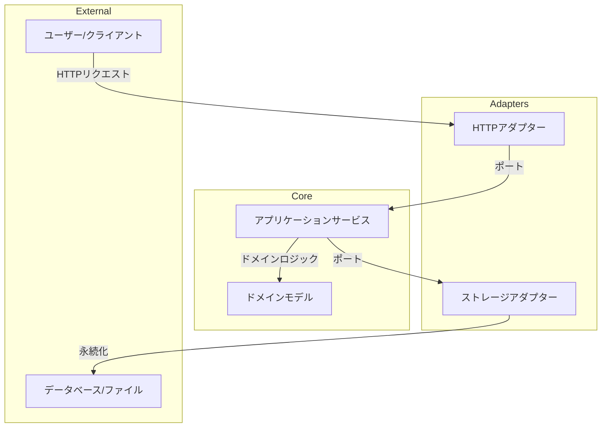

# OAuth 2.0 認可サーバー 設計書

## 1. 概要

このドキュメントは、Go 言語で実装される OAuth 2.0 認可サーバーの設計について記述します。関数型プログラミングの原則とヘキサゴナルアーキテクチャを採用し、保守性と拡張性の高いシステムを目指します。

## 2. アーキテクチャ

ヘキサゴナルアーキテクチャ（ポートとアダプターパターン）を採用します。コアとなるドメインロジックとアプリケーションサービスを中央に配置し、外部とのインターフェース（HTTP、ストレージなど）をアダプターとして実装します。



- **ドメインモデル (Domain):** システムの中核となるビジネスルールとデータ構造を定義します。値オブジェクト、エンティティ、集約などの DDD パターンを適用します。
- **アプリケーションサービス (AppService):** ユースケースを実現するための処理フローを実装します。ドメインモデルを操作し、リポジトリを通じてデータの永続化を行います。
- **ポート (Ports):** コアとアダプター間のインターフェースを定義します。アプリケーションサービスが要求するインターフェース（入力ポート）と、アプリケーションサービスが利用するインターフェース（出力ポート、例: リポジトリ）が含まれます。
- **アダプター (Adapters):** 特定の技術や外部システムとの接続を担当します。
  - **HTTP アダプター:** HTTP リクエストを受け付け、アプリケーションサービスを呼び出し、HTTP レスポンスを返します。
  - **ストレージアダプター:** リポジトリインターフェースを実装し、データの永続化（インメモリ、ファイル、データベースなど）を行います。

## 3. モジュール構成

計画で提案した以下のパッケージ構造を採用します。

```
go/oauth-server/
├── cmd/server/main.go           # エントリーポイント
├── docs/                        # ドキュメント
├── internal/
│   ├── domain/                  # ドメインモデル
│   ├── app/                     # アプリケーションサービス
│   ├── ports/                   # インターフェース定義
│   ├── adapters/                # アダプター実装
│   │   ├── http/                # HTTPアダプター
│   │   └── storage/             # ストレージアダプター
│   └── config/                  # 設定管理
├── pkg/                         # 再利用可能なパッケージ
│   ├── crypto/                  # 暗号化ユーティリティ
│   └── validator/               # バリデーションユーティリティ
├── config.yaml                  # 設定ファイル
├── go.mod                       # Goモジュール定義
└── go.sum                       # Goモジュールチェックサム
```

## 4. ドメインモデル設計

要件定義に基づき、以下の主要なドメインモデルを設計します。関数型アプローチを意識し、イミュータブルな設計を優先します。

### 4.1 Client (クライアント)

```go
package domain

import "time"

type ClientID string
type ClientSecret string // ハッシュ化されたシークレットを想定

// Client は OAuth クライアントを表すエンティティ
type Client struct {
	ID           ClientID
	Secret       ClientSecret // 永続化する際はハッシュ化
	Name         string
	RedirectURIs []string
	GrantTypes   []GrantType
	Scopes       []Scope
	CreatedAt    time.Time
}

// GrantType は許可される認可フローの種類
type GrantType string

const (
	GrantTypeAuthorizationCode GrantType = "authorization_code"
	GrantTypeImplicit          GrantType = "implicit" // オプション
	GrantTypeClientCredentials GrantType = "client_credentials"
	GrantTypePassword          GrantType = "password" // オプション
	GrantTypeRefreshToken      GrantType = "refresh_token"
)

// NewClient は新しいクライアントを生成するファクトリ関数 (純粋関数)
func NewClient(id ClientID, hashedSecret ClientSecret, name string, redirectURIs []string, grantTypes []GrantType, scopes []Scope, now time.Time) (Client, error) {
	// バリデーション
	if id == "" || name == "" {
		return Client{}, errors.New("クライアントIDと名前は必須です")
	}
	// ... その他のバリデーション

	return Client{
		ID:           id,
		Secret:       hashedSecret,
		Name:         name,
		RedirectURIs: redirectURIs,
		GrantTypes:   grantTypes,
		Scopes:       scopes,
		CreatedAt:    now,
	}, nil
}

// ValidateRedirectURI はリダイレクトURIが登録されているか検証する (純粋関数)
func (c Client) ValidateRedirectURI(uri string) bool {
	for _, registeredURI := range c.RedirectURIs {
		if registeredURI == uri {
			return true
		}
	}
	return false
}

// HasGrantType は指定された認可フローが許可されているか検証する (純粋関数)
func (c Client) HasGrantType(grantType GrantType) bool {
	for _, allowedType := range c.GrantTypes {
		if allowedType == grantType {
			return true
		}
	}
	return false
}

// ValidateScope は要求されたスコープがクライアントに許可されているか検証する (純粋関数)
func (c Client) ValidateScope(requestedScopes []Scope) bool {
	allowedScopeSet := make(map[Scope]struct{})
	for _, s := range c.Scopes {
		allowedScopeSet[s] = struct{}{}
	}

	for _, reqScope := range requestedScopes {
		if _, ok := allowedScopeSet[reqScope]; !ok {
			return false // 許可されていないスコープが含まれている
		}
	}
	return true
}
```

### 4.2 Token (トークン)

```go
package domain

import "time"

// TokenType はトークンの種類
type TokenType string

const (
	TokenTypeBearer TokenType = "Bearer"
)

// Token はアクセストークンまたはリフレッシュトークンを表す値オブジェクト
type Token struct {
	Value     string    // トークン文字列 (JWT またはランダム文字列)
	Type      TokenType // 通常は "Bearer"
	ClientID  ClientID
	UserID    UserID // リソースオーナーのID (該当する場合)
	Scopes    []Scope
	ExpiresAt time.Time
	IssuedAt  time.Time
}

// NewToken は新しいトークンを生成するファクトリ関数 (純粋関数)
func NewToken(value string, tokenType TokenType, clientID ClientID, userID UserID, scopes []Scope, issuedAt, expiresAt time.Time) (Token, error) {
	// バリデーション
	if value == "" || clientID == "" {
		return Token{}, errors.New("トークン値とクライアントIDは必須です")
	}
	if expiresAt.Before(issuedAt) {
		return Token{}, errors.New("有効期限が発行日時より前です")
	}
	// ...

	return Token{
		Value:     value,
		Type:      tokenType,
		ClientID:  clientID,
		UserID:    userID,
		Scopes:    scopes,
		ExpiresAt: expiresAt,
		IssuedAt:  issuedAt,
	}, nil
}

// IsExpired はトークンが有効期限切れか検証する (純粋関数)
func (t Token) IsExpired(now time.Time) bool {
	return now.After(t.ExpiresAt)
}

// HasScope は指定されたスコープが含まれているか検証する (純粋関数)
func (t Token) HasScope(requiredScope Scope) bool {
	for _, scope := range t.Scopes {
		if scope == requiredScope {
			return true
		}
	}
	return false
}
```

### 4.3 User (ユーザー)

```go
package domain

import "time"

type UserID string

// User はリソースオーナーを表すエンティティ
type User struct {
	ID             UserID
	Username       string
	HashedPassword string // ハッシュ化されたパスワード
	Email          string // オプション
	CreatedAt      time.Time
}

// NewUser は新しいユーザーを生成するファクトリ関数 (純粋関数)
func NewUser(id UserID, username, hashedPassword, email string, now time.Time) (User, error) {
	// バリデーション
	if id == "" || username == "" || hashedPassword == "" {
		return User{}, errors.New("ユーザーID, ユーザー名, ハッシュ化パスワードは必須です")
	}
	// ...

	return User{
		ID:             id,
		Username:       username,
		HashedPassword: hashedPassword,
		Email:          email,
		CreatedAt:      now,
	}, nil
}

// Note: パスワード検証はセキュリティ上の理由から、domain パッケージではなく、
// app パッケージや crypto パッケージで行う方が適切かもしれません。
// ここでは純粋なデータ構造として定義します。
```

### 4.4 Scope (スコープ)

```go
package domain

import "strings"

// Scope はアクセス権限を表す値オブジェクト
type Scope string

// ValidateScope はスコープ文字列の形式を検証する (純粋関数)
func ValidateScope(scopeStr string) ([]Scope, error) {
	if scopeStr == "" {
		return []Scope{}, nil // スコープなしも有効
	}
	parts := strings.Split(scopeStr, " ")
	scopes := make([]Scope, 0, len(parts))
	seen := make(map[Scope]struct{})
	for _, part := range parts {
		if part == "" {
			continue // 空の要素は無視
		}
		scope := Scope(part)
		// 簡単な形式チェック (例: 空白を含まない)
		if strings.ContainsAny(part, " \t\n\r") {
			return nil, errors.New("スコープ名に空白文字は含められません: " + part)
		}
		if _, exists := seen[scope]; exists {
			return nil, errors.New("スコープが重複しています: " + part)
		}
		scopes = append(scopes, scope)
		seen[scope] = struct{}{}
	}
	return scopes, nil
}

// FormatScopes はスコープのスライスをスペース区切りの文字列に変換する (純粋関数)
func FormatScopes(scopes []Scope) string {
	if len(scopes) == 0 {
		return ""
	}
	strs := make([]string, len(scopes))
	for i, s := range scopes {
		strs[i] = string(s)
	}
	return strings.Join(strs, " ")
}
```

### 4.5 AuthorizationCode (認可コード)

```go
package domain

import "time"

// AuthorizationCode は認可コードフローで使用される一時的なコードを表す値オブジェクト
type AuthorizationCode struct {
	Value       string
	ClientID    ClientID
	UserID      UserID
	RedirectURI string
	Scopes      []Scope
	ExpiresAt   time.Time
	IssuedAt    time.Time
	// PKCE 関連フィールド (オプション)
	// CodeChallenge       string
	// CodeChallengeMethod string
}

// NewAuthorizationCode は新しい認可コードを生成するファクトリ関数 (純粋関数)
func NewAuthorizationCode(value string, clientID ClientID, userID UserID, redirectURI string, scopes []Scope, issuedAt, expiresAt time.Time) (AuthorizationCode, error) {
	// バリデーション
	if value == "" || clientID == "" || userID == "" || redirectURI == "" {
		return AuthorizationCode{}, errors.New("認可コードの必須フィールドが不足しています")
	}
	if expiresAt.Before(issuedAt) {
		return AuthorizationCode{}, errors.New("有効期限が発行日時より前です")
	}
	// ...

	return AuthorizationCode{
		Value:       value,
		ClientID:    clientID,
		UserID:      userID,
		RedirectURI: redirectURI,
		Scopes:      scopes,
		ExpiresAt:   expiresAt,
		IssuedAt:    issuedAt,
	}, nil
}

// IsExpired は認可コードが有効期限切れか検証する (純粋関数)
func (c AuthorizationCode) IsExpired(now time.Time) bool {
	return now.After(c.ExpiresAt)
}
```

## 5. アプリケーションサービス設計

アプリケーションサービスは、ユースケースを実現するための具体的な処理フローを実装します。副作用（リポジトリへのアクセス、時刻取得、乱数生成など）はインターフェースを通じて注入されるか、明示的に扱われます。

### 5.1 AuthService (認証/認可サービス)

```go
package app

import (
	"context"
	"time"

	"github.com/ss49919201/ai-playground/go/oauth-server/internal/domain"
	"github.com/ss49919201/ai-playground/go/oauth-server/internal/ports"
)

// AuthService は認証と認可に関連するユースケースを処理する
type AuthService struct {
	clientRepo ports.ClientRepository
	userRepo   ports.UserRepository
	codeRepo   ports.AuthorizationCodeRepository
	tokenRepo  ports.TokenRepository // トークン発行のために必要になる場合がある
	pwHasher   ports.PasswordHasher
	codeIssuer ports.CodeIssuer       // 認可コード生成 (副作用)
	tokenIssuer ports.TokenIssuer     // トークン生成 (副作用)
	clock      ports.Clock            // 時刻取得 (副作用)
}

// NewAuthService は AuthService の新しいインスタンスを生成する
func NewAuthService(/* 依存性を引数で受け取る */) *AuthService {
	// ...
}

// AuthorizeRequest は認可リクエストのパラメータ
type AuthorizeRequest struct {
	ResponseType string
	ClientID     domain.ClientID
	RedirectURI  string
	Scope        string
	State        string
	// PKCE 関連 (オプション)
	// CodeChallenge       string
	// CodeChallengeMethod string
	// ユーザー認証情報 (セッションなどから取得)
	UserID domain.UserID
}

// AuthorizeResponse は認可レスポンスのパラメータ
type AuthorizeResponse struct {
	RedirectURI string // リダイレクト先のURI
	Code        string // 認可コード (認可コードフロー)
	AccessToken string // アクセストークン (インプリシットフロー)
	TokenType   string // トークンタイプ (インプリシットフロー)
	ExpiresIn   int    // トークン有効期間 (秒) (インプリシットフロー)
	State       string // CSRF対策
	Scope       string // 許可されたスコープ
}

// Authorize は認可リクエストを処理するメソッド
func (s *AuthService) Authorize(ctx context.Context, req AuthorizeRequest) (AuthorizeResponse, error) {
	now := s.clock.Now()

	// 1. クライアント取得と検証
	client, err := s.clientRepo.FindByID(ctx, req.ClientID)
	if err != nil {
		// エラーハンドリング (クライアントが見つからないなど)
		return AuthorizeResponse{}, err // TODO: OAuth 2.0 のエラーレスポンス形式に変換
	}
	if !client.ValidateRedirectURI(req.RedirectURI) {
		return AuthorizeResponse{}, errors.New("無効なリダイレクトURIです") // TODO: OAuth 2.0 エラー
	}

	// 2. スコープの検証と解析
	requestedScopes, err := domain.ValidateScope(req.Scope)
	if err != nil {
		return AuthorizeResponse{}, err // TODO: OAuth 2.0 エラー (invalid_scope)
	}
	if !client.ValidateScope(requestedScopes) {
		return AuthorizeResponse{}, errors.New("クライアントに許可されていないスコープが含まれています") // TODO: OAuth 2.0 エラー (invalid_scope)
	}
	// TODO: ユーザーにスコープの同意を求める処理 (ここでは省略)
	grantedScopes := requestedScopes // 同意が得られたスコープとする

	// 3. レスポンスタイプに応じた処理
	switch req.ResponseType {
	case "code": // 認可コードフロー
		if !client.HasGrantType(domain.GrantTypeAuthorizationCode) {
			return AuthorizeResponse{}, errors.New("このクライアントは認可コードフローを許可されていません") // TODO: OAuth 2.0 エラー
		}

		// 認可コード生成 (副作用)
		codeValue, err := s.codeIssuer.IssueCode()
		if err != nil {
			return AuthorizeResponse{}, err
		}
		codeLifetime := time.Minute * 10 // 例: 10分
		expiresAt := now.Add(codeLifetime)
		authCode, err := domain.NewAuthorizationCode(codeValue, client.ID, req.UserID, req.RedirectURI, grantedScopes, now, expiresAt)
		if err != nil {
			return AuthorizeResponse{}, err
		}

		// 認可コード保存 (副作用)
		if err := s.codeRepo.Save(ctx, authCode); err != nil {
			return AuthorizeResponse{}, err
		}

		// リダイレクトURIにパラメータを追加
		redirectURL, _ := url.Parse(req.RedirectURI)
		query := redirectURL.Query()
		query.Set("code", authCode.Value)
		if req.State != "" {
			query.Set("state", req.State)
		}
		redirectURL.RawQuery = query.Encode()

		return AuthorizeResponse{
			RedirectURI: redirectURL.String(),
			State:       req.State, // state はリダイレクトパラメータに含まれるが、レスポンス構造にも含める場合がある
		}, nil

	case "token": // インプリシットフロー (オプション)
		if !client.HasGrantType(domain.GrantTypeImplicit) {
			return AuthorizeResponse{}, errors.New("このクライアントはインプリシットフローを許可されていません") // TODO: OAuth 2.0 エラー
		}

		// アクセストークン生成 (副作用)
		accessTokenValue, err := s.tokenIssuer.IssueToken()
		if err != nil {
			return AuthorizeResponse{}, err
		}
		tokenLifetime := time.Hour * 1 // 例: 1時間
		expiresAt := now.Add(tokenLifetime)
		accessToken, err := domain.NewToken(accessTokenValue, domain.TokenTypeBearer, client.ID, req.UserID, grantedScopes, now, expiresAt)
		if err != nil {
			return AuthorizeResponse{}, err
		}

		// トークン保存 (副作用) - インプリシットフローでは通常保存しないが、ログや管理目的で保存する場合もある
		// if err := s.tokenRepo.Save(ctx, accessToken); err != nil { ... }

		// リダイレクトURIのフラグメントにパラメータを追加
		redirectURL, _ := url.Parse(req.RedirectURI)
		fragment := url.Values{}
		fragment.Set("access_token", accessToken.Value)
		fragment.Set("token_type", string(accessToken.Type))
		fragment.Set("expires_in", fmt.Sprintf("%d", int(tokenLifetime.Seconds())))
		fragment.Set("scope", domain.FormatScopes(grantedScopes))
		if req.State != "" {
			fragment.Set("state", req.State)
		}
		redirectURL.Fragment = fragment.Encode()

		return AuthorizeResponse{
			RedirectURI: redirectURL.String(),
			State:       req.State,
		}, nil

	default:
		return AuthorizeResponse{}, errors.New("無効なレスポンスタイプです") // TODO: OAuth 2.0 エラー (unsupported_response_type)
	}
}

// AuthenticateUser はユーザー名とパスワードでユーザーを認証する
func (s *AuthService) AuthenticateUser(ctx context.Context, username, password string) (domain.User, error) {
	user, err := s.userRepo.FindByUsername(ctx, username)
	if err != nil {
		// ユーザーが見つからない場合のエラー
		return domain.User{}, errors.New("ユーザー名またはパスワードが違います")
	}

	// パスワード検証 (副作用)
	match, err := s.pwHasher.Compare(user.HashedPassword, password)
	if err != nil {
		// ハッシュ比較エラー
		return domain.User{}, err
	}
	if !match {
		return domain.User{}, errors.New("ユーザー名またはパスワードが違います")
	}

	return user, nil
}
```

### 5.2 TokenService (トークンサービス)

```go
package app

import (
	"context"
	"errors"
	"time"

	"github.com/ss49919201/ai-playground/go/oauth-server/internal/domain"
	"github.com/ss49919201/ai-playground/go/oauth-server/internal/ports"
)

// TokenService はトークンの発行、検証、失効に関連するユースケースを処理する
type TokenService struct {
	clientRepo ports.ClientRepository
	userRepo   ports.UserRepository
	codeRepo   ports.AuthorizationCodeRepository
	tokenRepo  ports.TokenRepository
	pwHasher   ports.PasswordHasher
	tokenIssuer ports.TokenIssuer // トークン生成 (副作用)
	clock      ports.Clock        // 時刻取得 (副作用)
}

// NewTokenService は TokenService の新しいインスタンスを生成する
func NewTokenService(/* 依存性を引数で受け取る */) *TokenService {
	// ...
}

// IssueTokenRequest はトークン発行リクエストのパラメータ
type IssueTokenRequest struct {
	GrantType    string
	Code         string // 認可コードフロー
	RedirectURI  string // 認可コードフロー
	ClientID     domain.ClientID
	ClientSecret string // クライアント認証用
	Username     string // パスワードクレデンシャル フロー
	Password     string // パスワードクレデンシャル フロー
	RefreshToken string // リフレッシュトークンフロー
	Scope        string // オプション: スコープの絞り込み
}

// IssueTokenResponse はトークン発行レスポンスのパラメータ
type IssueTokenResponse struct {
	AccessToken  string `json:"access_token"`
	TokenType    string `json:"token_type"`
	ExpiresIn    int    `json:"expires_in"` // 秒
	RefreshToken string `json:"refresh_token,omitempty"`
	Scope        string `json:"scope,omitempty"`
}

// IssueToken はトークン発行リクエストを処理するメソッド
func (s *TokenService) IssueToken(ctx context.Context, req IssueTokenRequest) (IssueTokenResponse, error) {
	now := s.clock.Now()

	// 1. クライアント認証
	client, err := s.clientRepo.FindByID(ctx, req.ClientID)
	if err != nil {
		return IssueTokenResponse{}, errors.New("無効なクライアントです") // TODO: OAuth 2.0 エラー (invalid_client)
	}
	// クライアントシークレットの検証 (副作用)
	// grant_typeによっては不要な場合もある
	if req.GrantType != string(domain.GrantTypeImplicit) { // インプリシット以外は基本的に必要
		match, err := s.pwHasher.Compare(string(client.Secret), req.ClientSecret)
		if err != nil || !match {
			return IssueTokenResponse{}, errors.New("クライアント認証に失敗しました") // TODO: OAuth 2.0 エラー (invalid_client)
		}
	}

	// 2. Grant Type に応じた処理
	var userID domain.UserID
	var grantedScopes []domain.Scope

	switch domain.GrantType(req.GrantType) {
	case domain.GrantTypeAuthorizationCode:
		if !client.HasGrantType(domain.GrantTypeAuthorizationCode) {
			return IssueTokenResponse{}, errors.New("unauthorized_client")
		}
		// 認可コードの検証
		authCode, err := s.codeRepo.FindByValue(ctx, req.Code)
		if err != nil || authCode.IsExpired(now) || authCode.ClientID != client.ID || authCode.RedirectURI != req.RedirectURI {
			return IssueTokenResponse{}, errors.New("invalid_grant") // 無効な認可コード
		}
		// 認可コードを削除 (一度きり有効)
		if err := s.codeRepo.Delete(ctx, authCode.Value); err != nil {
			// エラー処理
			return IssueTokenResponse{}, err
		}
		userID = authCode.UserID
		grantedScopes = authCode.Scopes

	case domain.GrantTypePassword:
		if !client.HasGrantType(domain.GrantTypePassword) {
			return IssueTokenResponse{}, errors.New("unauthorized_client")
		}
		// ユーザー認証
		user, err := s.AuthenticateUser(ctx, req.Username, req.Password) // AuthServiceのメソッドを再利用 or TokenService内に実装
		if err != nil {
			return IssueTokenResponse{}, errors.New("invalid_grant") // 認証失敗
		}
		userID = user.ID
		// スコープの決定 (リクエストされたスコープとクライアント/ユーザーに許可されたスコープの積集合)
		requestedScopes, _ := domain.ValidateScope(req.Scope)
		grantedScopes = s.determineGrantedScopes(client.Scopes, user.Scopes, requestedScopes) // user.Scopes は仮

	case domain.GrantTypeClientCredentials:
		if !client.HasGrantType(domain.GrantTypeClientCredentials) {
			return IssueTokenResponse{}, errors.New("unauthorized_client")
		}
		// クライアント自身のトークンなので UserID はなし
		userID = ""
		requestedScopes, _ := domain.ValidateScope(req.Scope)
		grantedScopes = s.determineGrantedScopes(client.Scopes, nil, requestedScopes)

	case domain.GrantTypeRefreshToken:
		if !client.HasGrantType(domain.GrantTypeRefreshToken) {
			return IssueTokenResponse{}, errors.New("unauthorized_client")
		}
		// リフレッシュトークンの検証
		refreshToken, err := s.tokenRepo.FindByValue(ctx, req.RefreshToken)
		if err != nil || refreshToken.IsExpired(now) || refreshToken.ClientID != client.ID {
			return IssueTokenResponse{}, errors.New("invalid_grant") // 無効なリフレッシュトークン
		}
		// オプション: リフレッシュトークンを失効させる (ローテーション)
		// if err := s.tokenRepo.Delete(ctx, refreshToken.Value); err != nil { ... }

		userID = refreshToken.UserID
		// スコープの決定 (元のトークンのスコープを引き継ぐか、リクエストで絞り込む)
		requestedScopes, _ := domain.ValidateScope(req.Scope)
		grantedScopes = s.determineGrantedScopes(refreshToken.Scopes, nil, requestedScopes) // 元のスコープを上限とする

	default:
		return IssueTokenResponse{}, errors.New("unsupported_grant_type")
	}

	// 3. アクセストークン生成
	accessTokenValue, err := s.tokenIssuer.IssueToken()
	if err != nil {
		return IssueTokenResponse{}, err
	}
	accessTokenLifetime := time.Hour * 1 // 例: 1時間
	accessTokenExpiresAt := now.Add(accessTokenLifetime)
	accessToken, err := domain.NewToken(accessTokenValue, domain.TokenTypeBearer, client.ID, userID, grantedScopes, now, accessTokenExpiresAt)
	if err != nil {
		return IssueTokenResponse{}, err
	}
	if err := s.tokenRepo.Save(ctx, accessToken); err != nil {
		return IssueTokenResponse{}, err
	}

	// 4. リフレッシュトークン生成 (必要な場合)
	var refreshTokenValue string
	var refreshToken domain.Token
	issueRefreshToken := client.HasGrantType(domain.GrantTypeRefreshToken) &&
		(domain.GrantType(req.GrantType) == domain.GrantTypeAuthorizationCode || domain.GrantType(req.GrantType) == domain.GrantTypePassword || domain.GrantType(req.GrantType) == domain.GrantTypeRefreshToken)

	if issueRefreshToken {
		refreshTokenValue, err = s.tokenIssuer.IssueToken() // アクセストークンとは別の値を生成
		if err != nil {
			return IssueTokenResponse{}, err
		}
		refreshTokenLifetime := time.Hour * 24 * 30 // 例: 30日
		refreshTokenExpiresAt := now.Add(refreshTokenLifetime)
		refreshToken, err = domain.NewToken(refreshTokenValue, "", client.ID, userID, grantedScopes, now, refreshTokenExpiresAt) // Typeは空など
		if err != nil {
			return IssueTokenResponse{}, err
		}
		if err := s.tokenRepo.Save(ctx, refreshToken); err != nil {
			return IssueTokenResponse{}, err
		}
	}

	// 5. レスポンス生成
	return IssueTokenResponse{
		AccessToken:  accessToken.Value,
		TokenType:    string(accessToken.Type),
		ExpiresIn:    int(accessTokenLifetime.Seconds()),
		RefreshToken: refreshTokenValue, // 生成した場合のみ設定
		Scope:        domain.FormatScopes(grantedScopes),
	}, nil
}

// ValidateToken はアクセストークンを検証する
func (s *TokenService) ValidateToken(ctx context.Context, tokenValue string) (domain.Token, error) {
	token, err := s.tokenRepo.FindByValue(ctx, tokenValue)
	if err != nil {
		return domain.Token{}, errors.New("invalid_token")
	}
	if token.IsExpired(s.clock.Now()) {
		return domain.Token{}, errors.New("invalid_token") // expired
	}
	// TODO: トークンタイプが Access Token であることの確認

	// オプション: JWTの場合、署名検証などを行う
	// payload, err := s.tokenIssuer.Verify(tokenValue) ...

	return token, nil
}

// RevokeToken はトークンを失効させる
func (s *TokenService) RevokeToken(ctx context.Context, tokenValue string, clientID domain.ClientID) error {
	token, err := s.tokenRepo.FindByValue(ctx, tokenValue)
	if err != nil {
		return nil // トークンが存在しなくてもエラーとはしない (RFC 7009)
	}

	// クライアントIDが一致するか確認 (オプションだが推奨)
	if token.ClientID != clientID {
		return errors.New("invalid_request") // クライアントが一致しない
	}

	if err := s.tokenRepo.Delete(ctx, tokenValue); err != nil {
		return err
	}
	return nil
}

// AuthenticateUser (TokenService内での実装例)
func (s *TokenService) AuthenticateUser(ctx context.Context, username, password string) (domain.User, error) {
	// AuthService.AuthenticateUser と同様の実装
	user, err := s.userRepo.FindByUsername(ctx, username)
	if err != nil {
		return domain.User{}, errors.New("invalid_grant")
	}
	match, err := s.pwHasher.Compare(user.HashedPassword, password)
	if err != nil || !match {
		return domain.User{}, errors.New("invalid_grant")
	}
	return user, nil
}

// determineGrantedScopes は許可されるスコープを決定するヘルパー関数
func (s *TokenService) determineGrantedScopes(clientScopes []domain.Scope, userScopes []domain.Scope, requestedScopes []domain.Scope) []domain.Scope {
	allowedSet := make(map[domain.Scope]struct{})
	// クライアントに許可されたスコープをベースにする
	for _, s := range clientScopes {
		allowedSet[s] = struct{}{}
	}
	// ユーザー固有のスコープがあれば、それも考慮する (今回は省略)
	// if userScopes != nil { ... }

	var granted []domain.Scope
	if len(requestedScopes) == 0 {
		// リクエストがない場合は、クライアントに許可された全スコープを返す (あるいはデフォルトスコープ)
		granted = clientScopes
	} else {
		// リクエストされたスコープのうち、許可されたものだけを返す
		for _, reqScope := range requestedScopes {
			if _, ok := allowedSet[reqScope]; ok {
				granted = append(granted, reqScope)
			}
		}
	}
	return granted
}

```

### 5.3 ClientService (クライアント管理サービス)

```go
package app

import (
	"context"
	"errors"

	"github.com/ss49919201/ai-playground/go/oauth-server/internal/domain"
	"github.com/ss49919201/ai-playground/go/oauth-server/internal/ports"
)

// ClientService はクライアントの登録や管理に関連するユースケースを処理する
type ClientService struct {
	clientRepo ports.ClientRepository
	idGenerator ports.IDGenerator     // ClientID生成 (副作用)
	secretHasher ports.PasswordHasher // ClientSecretハッシュ化 (副作用)
	clock      ports.Clock          // 時刻取得 (副作用)
}

// NewClientService は ClientService の新しいインスタンスを生成する
func NewClientService(/* 依存性を引数で受け取る */) *ClientService {
	// ...
}

// RegisterClientRequest はクライアント登録リクエストのパラメータ
type RegisterClientRequest struct {
	Name         string
	RedirectURIs []string
	GrantTypes   []string
	Scopes       []string
	// ClientSecret string // オプション: 事前生成されたシークレットを受け付ける場合
}

// RegisterClientResponse はクライアント登録レスポンスのパラメータ
type RegisterClientResponse struct {
	ClientID     domain.ClientID `json:"client_id"`
	ClientSecret string          `json:"client_secret"` // 生成された平文のシークレットを一度だけ返す
	Name         string          `json:"client_name"`
	RedirectURIs []string        `json:"redirect_uris"`
	GrantTypes   []string        `json:"grant_types"`
	Scopes       []string        `json:"scopes"`
	CreatedAt    time.Time       `json:"created_at"`
}

// RegisterClient は新しいクライアントを登録する
func (s *ClientService) RegisterClient(ctx context.Context, req RegisterClientRequest) (RegisterClientResponse, error) {
	now := s.clock.Now()

	// 1. ClientID と ClientSecret の生成 (副作用)
	clientID, err := s.idGenerator.Generate()
	if err != nil {
		return RegisterClientResponse{}, err
	}
	clientSecretPlain, err := s.idGenerator.GenerateSecret() // 平文のシークレット生成
	if err != nil {
		return RegisterClientResponse{}, err
	}
	hashedSecret, err := s.secretHasher.Hash(clientSecretPlain) // ハッシュ化 (副作用)
	if err != nil {
		return RegisterClientResponse{}, err
	}

	// 2. GrantType と Scope の変換
	grantTypes := make([]domain.GrantType, len(req.GrantTypes))
	for i, gt := range req.GrantTypes {
		grantTypes[i] = domain.GrantType(gt)
		// TODO: サポートするGrantTypeか検証
	}
	scopes := make([]domain.Scope, len(req.Scopes))
	for i, sc := range req.Scopes {
		scopes[i] = domain.Scope(sc)
		// TODO: サポートするScopeか検証
	}

	// 3. ドメインオブジェクト生成
	client, err := domain.NewClient(domain.ClientID(clientID), domain.ClientSecret(hashedSecret), req.Name, req.RedirectURIs, grantTypes, scopes, now)
	if err != nil {
		return RegisterClientResponse{}, err // バリデーションエラー
	}

	// 4. リポジトリに保存 (副作用)
	if err := s.clientRepo.Save(ctx, client); err != nil {
		return RegisterClientResponse{}, err
	}

	// 5. レスポンス生成 (平文のシークレットを含む)
	return RegisterClientResponse{
		ClientID:     client.ID,
		ClientSecret: clientSecretPlain, // 注意: この平文シークレットはこのレスポンスでのみ返す
		Name:         client.Name,
		RedirectURIs: client.RedirectURIs,
		GrantTypes:   req.GrantTypes, // 文字列スライスに戻す
		Scopes:       req.Scopes,     // 文字列スライスに戻す
		CreatedAt:    client.CreatedAt,
	}, nil
}

// GetClient は指定されたIDのクライアント情報を取得する
func (s *ClientService) GetClient(ctx context.Context, clientID domain.ClientID) (domain.Client, error) {
	client, err := s.clientRepo.FindByID(ctx, clientID)
	if err != nil {
		// エラーハンドリング (Not Foundなど)
		return domain.Client{}, err
	}
	// 注意: レスポンスとして返す場合、ハッシュ化されたシークレットは含めない方が良い
	client.Secret = ""
	return client, nil
}

// AuthenticateClient はクライアントIDとシークレットでクライアントを認証する
// Note: TokenService 内で直接行う方が効率的な場合もある
func (s *ClientService) AuthenticateClient(ctx context.Context, clientID domain.ClientID, clientSecret string) (bool, error) {
	client, err := s.clientRepo.FindByID(ctx, clientID)
	if err != nil {
		return false, errors.New("invalid_client")
	}
	match, err := s.secretHasher.Compare(string(client.Secret), clientSecret)
	if err != nil {
		return false, err // ハッシュ比較エラー
	}
	return match, nil
}
```

## 6. ポート (インターフェース) 設計

アプリケーションサービスが必要とする依存関係をインターフェースとして定義します。

```go
package ports

import (
	"context"
	"time"

	"github.com/ss49919201/ai-playground/go/oauth-server/internal/domain"
)

// --- リポジトリインターフェース ---

type ClientRepository interface {
	Save(ctx context.Context, client domain.Client) error
	FindByID(ctx context.Context, id domain.ClientID) (domain.Client, error)
	// List(ctx context.Context) ([]domain.Client, error) // 必要に応じて追加
	// Delete(ctx context.Context, id domain.ClientID) error // 必要に応じて追加
}

type UserRepository interface {
	Save(ctx context.Context, user domain.User) error
	FindByID(ctx context.Context, id domain.UserID) (domain.User, error)
	FindByUsername(ctx context.Context, username string) (domain.User, error)
}

type AuthorizationCodeRepository interface {
	Save(ctx context.Context, code domain.AuthorizationCode) error
	FindByValue(ctx context.Context, value string) (domain.AuthorizationCode, error)
	Delete(ctx context.Context, value string) error
}

type TokenRepository interface {
	Save(ctx context.Context, token domain.Token) error
	FindByValue(ctx context.Context, value string) (domain.Token, error) // アクセストークン、リフレッシュトークン両方を検索
	// FindByUserAndClient(ctx context.Context, userID domain.UserID, clientID domain.ClientID) ([]domain.Token, error) // 必要に応じて追加
	Delete(ctx context.Context, value string) error // トークン失効用
}

// --- 副作用インターフェース ---

// Clock は現在時刻を取得するインターフェース (副作用の抽象化)
type Clock interface {
	Now() time.Time
}

// PasswordHasher はパスワードのハッシュ化と比較を行うインターフェース (副作用の抽象化)
type PasswordHasher interface {
	Hash(password string) (string, error)
	Compare(hashedPassword, password string) (bool, error)
}

// IDGenerator は一意なIDを生成するインターフェース (副作用の抽象化)
type IDGenerator interface {
	Generate() (string, error)        // ClientID, UserID など
	GenerateSecret() (string, error) // ClientSecret (平文)
}

// CodeIssuer は認可コードの値を生成するインターフェース (副作用の抽象化)
type CodeIssuer interface {
	IssueCode() (string, error)
}

// TokenIssuer はトークン (JWTまたはランダム文字列) の生成と検証を行うインターフェース (副作用の抽象化)
type TokenIssuer interface {
	IssueToken() (string, error) // アクセストークン、リフレッシュトークンの値
	// Verify(tokenValue string) (Payload, error) // JWTの場合の検証メソッド (オプション)
}

// Payload はJWTトークンのペイロードを表す (オプション)
// type Payload struct {
// 	ClientID domain.ClientID
// 	UserID   domain.UserID
// 	Scopes   []domain.Scope
// 	ExpiresAt time.Time
// 	IssuedAt  time.Time
// 	// ... その他 claims
// }
```

## 7. アダプター設計

### 7.1 HTTP アダプター

- Go の標準 `net/http` パッケージをベースに実装します。
- ルーティングには `net/http.ServeMux` や外部ライブラリ (例: `gorilla/mux`, `chi`) を利用します。
- リクエストのパース、バリデーション、アプリケーションサービスの呼び出し、レスポンスの生成を担当します。
- エラーハンドリングを行い、適切な OAuth 2.0 エラーレスポンスを返却します。
- ミドルウェアを活用して、ロギング、認証、レート制限などの共通処理を実装します。

```go
package http

import (
	"encoding/json"
	"net/http"
	"strings"

	"github.com/ss49919201/ai-playground/go/oauth-server/internal/app"
	"github.com/ss49919201/ai-playground/go/oauth-server/internal/domain"
)

// Server はHTTPサーバーの依存関係を保持する
type Server struct {
	authService  *app.AuthService
	tokenService *app.TokenService
	clientService *app.ClientService
	mux          *http.ServeMux // または他のルーター
}

// NewServer はHTTPサーバーを初期化する
func NewServer(authSvc *app.AuthService, tokenSvc *app.TokenService, clientSvc *app.ClientService) *Server {
	s := &Server{
		authService:  authSvc,
		tokenService: tokenSvc,
		clientService: clientSvc,
		mux:          http.NewServeMux(),
	}
	s.registerHandlers()
	return s
}

// ServeHTTP は http.Handler インターフェースを実装
func (s *Server) ServeHTTP(w http.ResponseWriter, r *http.Request) {
	// TODO: ロギングミドルウェアなどをここに追加可能
	s.mux.ServeHTTP(w, r)
}

func (s *Server) registerHandlers() {
	s.mux.HandleFunc("/oauth/authorize", s.handleAuthorize)
	s.mux.HandleFunc("/oauth/token", s.handleToken)
	s.mux.HandleFunc("/oauth/introspect", s.handleIntrospect) // オプション
	s.mux.HandleFunc("/oauth/revoke", s.handleRevoke)       // オプション
	s.mux.HandleFunc("/oauth/clients", s.handleClients)     // 管理用
}

// handleAuthorize は認可エンドポイントのリクエストを処理する
func (s *Server) handleAuthorize(w http.ResponseWriter, r *http.Request) {
	if r.Method != http.MethodGet && r.Method != http.MethodPost { // POSTはログインフォーム用など
		http.Error(w, "Method Not Allowed", http.StatusMethodNotAllowed)
		return
	}

	// TODO: ユーザー認証状態の確認 (セッションなど)
	// この例では認証済みで UserID が取得できているとする
	userID := domain.UserID("user-123") // 仮のユーザーID

	// リクエストパラメータの取得とバリデーション
	query := r.URL.Query()
	req := app.AuthorizeRequest{
		ResponseType: query.Get("response_type"),
		ClientID:     domain.ClientID(query.Get("client_id")),
		RedirectURI:  query.Get("redirect_uri"),
		Scope:        query.Get("scope"),
		State:        query.Get("state"),
		UserID:       userID,
	}
	// TODO: リクエストのバリデーション (必須パラメータなど)

	// アプリケーションサービスの呼び出し
	resp, err := s.authService.Authorize(r.Context(), req)
	if err != nil {
		// TODO: OAuth 2.0 エラーレスポンスを生成して返す
		s.handleOAuthError(w, r, err, req.RedirectURI, req.State, req.ResponseType == "token")
		return
	}

	// 成功レスポンス (リダイレクト)
	http.Redirect(w, r, resp.RedirectURI, http.StatusFound)
}

// handleToken はトークンエンドポイントのリクエストを処理する
func (s *Server) handleToken(w http.ResponseWriter, r *http.Request) {
	if r.Method != http.MethodPost {
		http.Error(w, "Method Not Allowed", http.StatusMethodNotAllowed)
		return
	}

	// クライアント認証 (例: Basic認証)
	clientID, clientSecret, ok := r.BasicAuth()
	if !ok {
		// またはリクエストボディから取得 (client_id, client_secret)
		clientID = r.PostFormValue("client_id")
		clientSecret = r.PostFormValue("client_secret")
		if clientID == "" || clientSecret == "" {
			s.handleOAuthError(w, r, errors.New("invalid_client: クライアント認証が必要です"), "", "", false)
			return
		}
	}

	// リクエストボディのパース
	if err := r.ParseForm(); err != nil {
		s.handleOAuthError(w, r, errors.New("invalid_request: リクエストの解析に失敗しました"), "", "", false)
		return
	}

	req := app.IssueTokenRequest{
		GrantType:    r.PostFormValue("grant_type"),
		Code:         r.PostFormValue("code"),
		RedirectURI:  r.PostFormValue("redirect_uri"),
		ClientID:     domain.ClientID(clientID),
		ClientSecret: clientSecret,
		Username:     r.PostFormValue("username"),
		Password:     r.PostFormValue("password"),
		RefreshToken: r.PostFormValue("refresh_token"),
		Scope:        r.PostFormValue("scope"),
	}
	// TODO: リクエストのバリデーション

	// アプリケーションサービスの呼び出し
	resp, err := s.tokenService.IssueToken(r.Context(), req)
	if err != nil {
		s.handleOAuthError(w, r, err, "", "", false)
		return
	}

	// 成功レスポンス (JSON)
	w.Header().Set("Content-Type", "application/json;charset=UTF-8")
	w.Header().Set("Cache-Control", "no-store")
	w.Header().Set("Pragma", "no-cache")
	json.NewEncoder(w).Encode(resp)
}

// handleIntrospect はトークン情報エンドポイントのリクエストを処理する (オプション)
func (s *Server) handleIntrospect(w http.ResponseWriter, r *http.Request) {
	// TODO: 実装 (RFC 7662)
	// 1. リクエストからトークンを取得 (POST body: token)
	// 2. オプション: リソースサーバー認証
	// 3. tokenService.ValidateToken を呼び出し
	// 4. 結果をJSONで返す (active: true/false, scope, client_id, username, exp, etc.)
	http.Error(w, "Not Implemented", http.StatusNotImplemented)
}

// handleRevoke はトークン失効エンドポイントのリクエストを処理する (オプション)
func (s *Server) handleRevoke(w http.ResponseWriter, r *http.Request) {
	// TODO: 実装 (RFC 7009)
	// 1. クライアント認証
	// 2. リクエストから失効させるトークンを取得 (POST body: token, token_type_hint)
	// 3. tokenService.RevokeToken を呼び出し
	// 4. 成功レスポンス (200 OK)
	http.Error(w, "Not Implemented", http.StatusNotImplemented)
}

// handleClients はクライアント管理エンドポイントのリクエストを処理する (管理用)
func (s *Server) handleClients(w http.ResponseWriter, r *http.Request) {
	// TODO: 管理者認証が必要
	switch r.Method {
	case http.MethodPost: // クライアント登録
		var req app.RegisterClientRequest
		if err := json.NewDecoder(r.Body).Decode(&req); err != nil {
			http.Error(w, "Bad Request", http.StatusBadRequest)
			return
		}
		resp, err := s.clientService.RegisterClient(r.Context(), req)
		if err != nil {
			http.Error(w, "Internal Server Error", http.StatusInternalServerError) // TODO: 詳細なエラーハンドリング
			return
		}
		w.Header().Set("Content-Type", "application/json;charset=UTF-8")
		w.WriteHeader(http.StatusCreated)
		json.NewEncoder(w).Encode(resp)

	case http.MethodGet: // クライアント取得
		clientID := domain.ClientID(strings.TrimPrefix(r.URL.Path, "/oauth/clients/"))
		if clientID == "" {
			// TODO: クライアント一覧取得の実装
			http.Error(w, "Not Implemented", http.StatusNotImplemented)
			return
		}
		resp, err := s.clientService.GetClient(r.Context(), clientID)
		if err != nil {
			// TODO: Not Found などのエラーハンドリング
			http.Error(w, "Not Found", http.StatusNotFound)
			return
		}
		w.Header().Set("Content-Type", "application/json;charset=UTF-8")
		json.NewEncoder(w).Encode(resp)

	// TODO: PUT (更新), DELETE (削除) の実装
	default:
		http.Error(w, "Method Not Allowed", http.StatusMethodNotAllowed)
	}
}

// handleOAuthError は OAuth 2.0 のエラーレスポンスを生成するヘルパー
func (s *Server) handleOAuthError(w http.ResponseWriter, r *http.Request, err error, redirectURI, state string, isImplicit bool) {
	// TODO: エラーの種類に応じて適切な OAuth 2.0 エラーコード (invalid_request, invalid_client, etc.) と説明を決定する
	errorCode := "server_error"
	errorDesc := err.Error() // 実際にはもっと丁寧なメッセージに

	// 認可リクエストのエラーでリダイレクトURIが有効な場合
	if redirectURI != "" && (r.URL.Path == "/oauth/authorize") {
		redirectURL, parseErr := url.Parse(redirectURI)
		if parseErr == nil {
			if isImplicit { // インプリシットフローはフラグメント
				fragment := url.Values{}
				fragment.Set("error", errorCode)
				fragment.Set("error_description", errorDesc)
				if state != "" {
					fragment.Set("state", state)
				}
				redirectURL.Fragment = fragment.Encode()
			} else { // 認可コードフローはクエリパラメータ
				query := redirectURL.Query()
				query.Set("error", errorCode)
				query.Set("error_description", errorDesc)
				if state != "" {
					query.Set("state", state)
				}
				redirectURL.RawQuery = query.Encode()
			}
			http.Redirect(w, r, redirectURL.String(), http.StatusFound)
			return
		}
	}

	// トークンエンドポイントのエラーなど、リダイレクトしない場合
	w.Header().Set("Content-Type", "application/json;charset=UTF-8")
	w.Header().Set("Cache-Control", "no-store")
	w.Header().Set("Pragma", "no-cache")
	w.WriteHeader(http.StatusBadRequest) // または適切なステータスコード
	json.NewEncoder(w).Encode(map[string]string{
		"error":             errorCode,
		"error_description": errorDesc,
	})
}

```

### 7.2 ストレージアダプター

- `ports` パッケージで定義されたリポジトリインターフェースを実装します。
- まずはシンプルなインメモリストレージを実装し、後でファイルやデータベースへの永続化を追加できるようにします。
- スレッドセーフ性を確保するために、`sync.RWMutex` などを使用します。

```go
package storage

import (
	"context"
	"errors"
	"sync"
	"time"

	"github.com/ss49919201/ai-playground/go/oauth-server/internal/domain"
)

// InMemoryClientRepository は ClientRepository のインメモリ実装
type InMemoryClientRepository struct {
	mu      sync.RWMutex
	clients map[domain.ClientID]domain.Client
}

func NewInMemoryClientRepository() *InMemoryClientRepository {
	return &InMemoryClientRepository{
		clients: make(map[domain.ClientID]domain.Client),
	}
}

func (r *InMemoryClientRepository) Save(ctx context.Context, client domain.Client) error {
	r.mu.Lock()
	defer r.mu.Unlock()
	r.clients[client.ID] = client
	return nil
}

func (r *InMemoryClientRepository) FindByID(ctx context.Context, id domain.ClientID) (domain.Client, error) {
	r.mu.RLock()
	defer r.mu.RUnlock()
	client, ok := r.clients[id]
	if !ok {
		return domain.Client{}, errors.New("client not found") // TODO: 専用エラー型
	}
	return client, nil
}

// --- InMemoryUserRepository ---
type InMemoryUserRepository struct {
	mu       sync.RWMutex
	users    map[domain.UserID]domain.User
	username map[string]domain.UserID
}

func NewInMemoryUserRepository() *InMemoryUserRepository {
	return &InMemoryUserRepository{
		users:    make(map[domain.UserID]domain.User),
		username: make(map[string]domain.UserID),
	}
}
func (r *InMemoryUserRepository) Save(ctx context.Context, user domain.User) error {
	r.mu.Lock()
	defer r.mu.Unlock()
	// TODO: ユーザー名重複チェック
	r.users[user.ID] = user
	r.username[user.Username] = user.ID
	return nil
}
func (r *InMemoryUserRepository) FindByID(ctx context.Context, id domain.UserID) (domain.User, error) {
	r.mu.RLock()
	defer r.mu.RUnlock()
	user, ok := r.users[id]
	if !ok {
		return domain.User{}, errors.New("user not found")
	}
	return user, nil
}
func (r *InMemoryUserRepository) FindByUsername(ctx context.Context, username string) (domain.User, error) {
	r.mu.RLock()
	defer r.mu.RUnlock()
	id, ok := r.username[username]
	if !ok {
		return domain.User{}, errors.New("user not found")
	}
	user, ok := r.users[id]
	if !ok {
		// データ不整合の可能性
		return domain.User{}, errors.New("internal error: user data inconsistent")
	}
	return user, nil
}

// --- InMemoryAuthorizationCodeRepository ---
type InMemoryAuthorizationCodeRepository struct {
	mu    sync.RWMutex
	codes map[string]domain.AuthorizationCode
}

func NewInMemoryAuthorizationCodeRepository() *InMemoryAuthorizationCodeRepository {
	return &InMemoryAuthorizationCodeRepository{
		codes: make(map[string]domain.AuthorizationCode),
	}
}
func (r *InMemoryAuthorizationCodeRepository) Save(ctx context.Context, code domain.AuthorizationCode) error {
	r.mu.Lock()
	defer r.mu.Unlock()
	r.codes[code.Value] = code
	return nil
}
func (r *InMemoryAuthorizationCodeRepository) FindByValue(ctx context.Context, value string) (domain.AuthorizationCode, error) {
	r.mu.RLock()
	defer r.mu.RUnlock()
	code, ok := r.codes[value]
	if !ok {
		return domain.AuthorizationCode{}, errors.New("code not found")
	}
	return code, nil
}
func (r *InMemoryAuthorizationCodeRepository) Delete(ctx context.Context, value string) error {
	r.mu.Lock()
	defer r.mu.Unlock()
	delete(r.codes, value)
	return nil
}

// --- InMemoryTokenRepository ---
type InMemoryTokenRepository struct {
	mu     sync.RWMutex
	tokens map[string]domain.Token // key = token value
}

func NewInMemoryTokenRepository() *InMemoryTokenRepository {
	return &InMemoryTokenRepository{
		tokens: make(map[string]domain.Token),
	}
}
func (r *InMemoryTokenRepository) Save(ctx context.Context, token domain.Token) error {
	r.mu.Lock()
	defer r.mu.Unlock()
	r.tokens[token.Value] = token
	return nil
}
func (r *InMemoryTokenRepository) FindByValue(ctx context.Context, value string) (domain.Token, error) {
	r.mu.RLock()
	defer r.mu.RUnlock()
	token, ok := r.tokens[value]
	if !ok {
		return domain.Token{}, errors.New("token not found")
	}
	return token, nil
}
func (r *InMemoryTokenRepository) Delete(ctx context.Context, value string) error {
	r.mu.Lock()
	defer r.mu.Unlock()
	delete(r.tokens, value)
	return nil
}

// --- 副作用アダプターの実装例 ---

// SystemClock は ports.Clock を実装する
type SystemClock struct{}

func (c SystemClock) Now() time.Time {
	return time.Now()
}

// BcryptHasher は ports.PasswordHasher を実装する (golang.org/x/crypto/bcrypt)
type BcryptHasher struct {
	Cost int
}

func NewBcryptHasher(cost int) *BcryptHasher {
	if cost == 0 {
		cost = bcrypt.DefaultCost
	}
	return &BcryptHasher{Cost: cost}
}
func (h *BcryptHasher) Hash(password string) (string, error) {
	bytes, err := bcrypt.GenerateFromPassword([]byte(password), h.Cost)
	return string(bytes), err
}
func (h *BcryptHasher) Compare(hashedPassword, password string) (bool, error) {
	err := bcrypt.CompareHashAndPassword([]byte(hashedPassword), []byte(password))
	if err == nil {
		return true, nil
	}
	if errors.Is(err, bcrypt.ErrMismatchedHashAndPassword) {
		return false, nil // 不一致はエラーではない
	}
	return false, err // その他のエラー
}

// UUIDGenerator は ports.IDGenerator を実装する (github.com/google/uuid)
type UUIDGenerator struct{}

func (g UUIDGenerator) Generate() (string, error) {
	id, err := uuid.NewRandom()
	return id.String(), err
}
func (g UUIDGenerator) GenerateSecret() (string, error) {
	// よりセキュアなランダム文字列生成器を使用する
	b := make([]byte, 32) // 32バイト = 256ビット
	_, err := rand.Read(b)
	if err != nil {
		return "", err
	}
	return base64.URLEncoding.EncodeToString(b), nil
}

// RandomCodeIssuer は ports.CodeIssuer を実装する
type RandomCodeIssuer struct{}

func (i RandomCodeIssuer) IssueCode() (string, error) {
	// 認可コード用のランダム文字列生成
	b := make([]byte, 24) // 24バイト
	_, err := rand.Read(b)
	if err != nil {
		return "", err
	}
	return base64.URLEncoding.EncodeToString(b), nil
}

// RandomTokenIssuer は ports.TokenIssuer を実装する (JWTではない単純なランダム文字列)
type RandomTokenIssuer struct{}

func (i RandomTokenIssuer) IssueToken() (string, error) {
	// アクセストークン/リフレッシュトークン用のランダム文字列生成
	b := make([]byte, 32) // 32バイト
	_, err := rand.Read(b)
	if err != nil {
		return "", err
	}
	return base64.URLEncoding.EncodeToString(b), nil
}

// TODO: JWTTokenIssuer の実装 (github.com/golang-jwt/jwt/v5 などを使用)
```

### 7.3 設定アダプター

- `internal/config` パッケージで設定ファイルの読み込みとバリデーションを行います。
- YAML 形式の設定ファイルをサポートします (`gopkg.in/yaml.v2`)。

```go
package config

import (
	"fmt"
	"os"
	"time"

	"gopkg.in/yaml.v2"
)

type Config struct {
	Server ServerConfig `yaml:"server"`
	Token  TokenConfig  `yaml:"token"`
	// Storage StorageConfig `yaml:"storage"` // ストレージ設定
	// Crypto CryptoConfig `yaml:"crypto"` // 鍵情報など
}

type ServerConfig struct {
	Port int `yaml:"port"`
	// TLSCertFile string `yaml:"tlsCertFile"`
	// TLSKeyFile  string `yaml:"tlsKeyFile"`
}

type TokenConfig struct {
	AccessTokenLifetime  time.Duration `yaml:"accessTokenLifetime"`
	RefreshTokenLifetime time.Duration `yaml:"refreshTokenLifetime"`
	AuthCodeLifetime     time.Duration `yaml:"authCodeLifetime"`
	// JWTSigningKeyFile string        `yaml:"jwtSigningKeyFile"` // JWT用
	// JWTIssuer         string        `yaml:"jwtIssuer"`         // JWT用
}

func Load(path string) (*Config, error) {
	data, err := os.ReadFile(path)
	if err != nil {
		return nil, fmt.Errorf("設定ファイルの読み込みに失敗しました: %w", err)
	}

	// デフォルト値の設定
	cfg := Config{
		Server: ServerConfig{Port: 8080},
		Token: TokenConfig{
			AccessTokenLifetime:  time.Hour * 1,
			RefreshTokenLifetime: time.Hour * 24 * 30,
			AuthCodeLifetime:     time.Minute * 10,
		},
	}

	if err := yaml.Unmarshal(data, &cfg); err != nil {
		return nil, fmt.Errorf("設定ファイルの解析に失敗しました: %w", err)
	}

	if err := validate(&cfg); err != nil {
		return nil, fmt.Errorf("設定が無効です: %w", err)
	}

	return &cfg, nil
}

func validate(cfg *Config) error {
	if cfg.Server.Port <= 0 || cfg.Server.Port > 65535 {
		return fmt.Errorf("無効なポート番号: %d", cfg.Server.Port)
	}
	if cfg.Token.AccessTokenLifetime <= 0 || cfg.Token.RefreshTokenLifetime <= 0 || cfg.Token.AuthCodeLifetime <= 0 {
		return fmt.Errorf("トークンの有効期間は正の値である必要があります")
	}
	if cfg.Token.AccessTokenLifetime >= cfg.Token.RefreshTokenLifetime {
		// 通常はリフレッシュトークンの方が長い
	}
	// ... その他のバリデーション
	return nil
}

```

## 8. エントリーポイント (`cmd/server/main.go`)

- 設定ファイルを読み込みます。
- 各アダプターとサービスを初期化し、依存性を注入します。
- HTTP サーバーを起動します。
- シグナルハンドリングを行い、 graceful shutdown を実装します。

```go
package main

import (
	"flag"
	"fmt"
	"log"
	"net/http"
	"os"
	"os/signal"
	"syscall"
	"time"

	"github.com/ss49919201/ai-playground/go/oauth-server/internal/app"
	"github.com/ss49919201/ai-playground/go/oauth-server/internal/adapters/http"
	"github.com/ss49919201/ai-playground/go/oauth-server/internal/adapters/storage"
	"github.com/ss49919201/ai-playground/go/oauth-server/internal/config"
	// crypto "github.com/ss49919201/ai-playground/go/oauth-server/pkg/crypto" // 仮
)

func main() {
	configPath := flag.String("config", "config.yaml", "Path to configuration file")
	flag.Parse()

	// 1. 設定読み込み
	cfg, err := config.Load(*configPath)
	if err != nil {
		log.Fatalf("設定の読み込みに失敗しました: %v", err)
	}

	// 2. 依存関係の初期化 (アダプター -> サービス)
	// ストレージアダプター
	clientRepo := storage.NewInMemoryClientRepository()
	userRepo := storage.NewInMemoryUserRepository()
	codeRepo := storage.NewInMemoryAuthorizationCodeRepository()
	tokenRepo := storage.NewInMemoryTokenRepository()

	// 副作用アダプター
	clock := storage.SystemClock{}
	hasher := storage.NewBcryptHasher(0) // デフォルトコスト
	idGen := storage.UUIDGenerator{}
	codeIssuer := storage.RandomCodeIssuer{}
	tokenIssuer := storage.RandomTokenIssuer{} // または JWTTokenIssuer

	// アプリケーションサービス
	authService := app.NewAuthService(clientRepo, userRepo, codeRepo, tokenRepo, hasher, codeIssuer, tokenIssuer, clock)
	tokenService := app.NewTokenService(clientRepo, userRepo, codeRepo, tokenRepo, hasher, tokenIssuer, clock)
	clientService := app.NewClientService(clientRepo, idGen, hasher, clock)

	// HTTPアダプター
	httpServer := httpadapter.NewServer(authService, tokenService, clientService)

	// 3. HTTPサーバーの設定と起動
	addr := fmt.Sprintf(":%d", cfg.Server.Port)
	server := &http.Server{
		Addr:         addr,
		Handler:      httpServer, // ここでミドルウェアを追加することも可能
		ReadTimeout:  5 * time.Second,
		WriteTimeout: 10 * time.Second,
		IdleTimeout:  120 * time.Second,
	}

	go func() {
		log.Printf("OAuth 2.0 サーバーを %s で起動します...", addr)
		// TODO: TLS設定
		if err := server.ListenAndServe(); err != nil && err != http.ErrServerClosed {
			log.Fatalf("サーバーの起動に失敗しました: %v", err)
		}
	}()

	// 4. Graceful Shutdown
	quit := make(chan os.Signal, 1)
	signal.Notify(quit, syscall.SIGINT, syscall.SIGTERM)
	<-quit
	log.Println("サーバーをシャットダウンします...")

	ctx, cancel := context.WithTimeout(context.Background(), 30*time.Second)
	defer cancel()

	if err := server.Shutdown(ctx); err != nil {
		log.Fatalf("サーバーのシャットダウンに失敗しました: %v", err)
	}
	log.Println("サーバーは正常にシャットダウンしました")
}

```

## 9. テスト戦略

- **ユニットテスト:**
  - ドメインモデルの純粋関数（ファクトリ、バリデーションなど）をテストします。
  - アプリケーションサービスのロジックを、モック化されたリポジトリや副作用インターフェースを使用してテストします (`gomock` など)。
  - アダプターの単体機能をテストします（例: 設定ファイルのパース、ハッシュ化関数）。
- **統合テスト:**
  - インメモリストレージを使用して、アプリケーションサービスとリポジトリの連携をテストします。
  - HTTP アダプターとアプリケーションサービスの連携を、`net/http/httptest` を使用してテストします。
- **E2E テスト (オプション):**
  - 実際にサーバーを起動し、HTTP クライアントを使用して OAuth 2.0 フロー全体をテストします。

## 10. セキュリティ考慮事項

- **入力バリデーション:** すべての外部からの入力（HTTP リクエストパラメータ、設定ファイル）を厳密に検証します。
- **出力エンコーディング:** HTTP レスポンス（特に HTML を含む認可ページなど）で適切なエンコーディングを行い、XSS を防止します。
- **依存関係管理:** `go.sum` を使用して依存関係の完全性を確保し、脆弱性のあるライブラリを使用しないようにします。
- **秘密情報管理:** クライアントシークレットや署名鍵などの秘密情報は、設定ファイルに直接記述せず、環境変数やシークレット管理システムから読み込むことを検討します。
- **エラーハンドリング:** 詳細な内部エラー情報をクライアントに漏洩させないように、汎用的なエラーメッセージを返します。ログには詳細な情報を記録します。
- **ライブラリの選択:** 信頼できる標準ライブラリや、コミュニティで広くレビューされているライブラリを選択します。

## 11. 関数型アプローチの適用箇所

- ドメインモデルのファクトリ関数やバリデーションメソッドを純粋関数として実装します。
- ドメインモデルの状態変更は、新しいインスタンスを返すイミュータブルな操作を基本とします。
- アプリケーションサービスでは、副作用（時刻取得、乱数生成、DB アクセス）をインターフェースとして抽象化し、外部から注入します。
- 可能であれば、高階関数や関数合成を利用してロジックを組み立てます（ただし、Go の言語特性を考慮し、過度な抽象化は避けます）。
- エラー処理は、Go の標準的なエラーハンドリングパターン（`error` インターフェース）を使用し、明示的に扱います。
