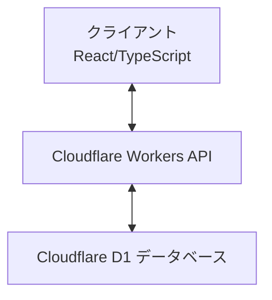
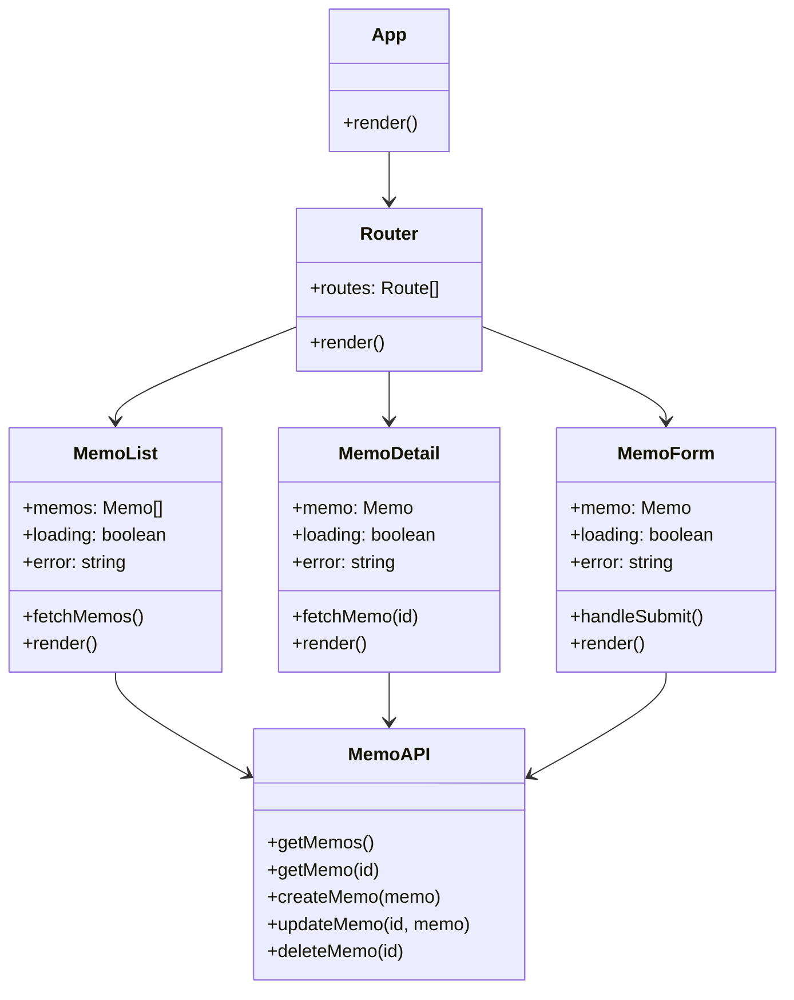
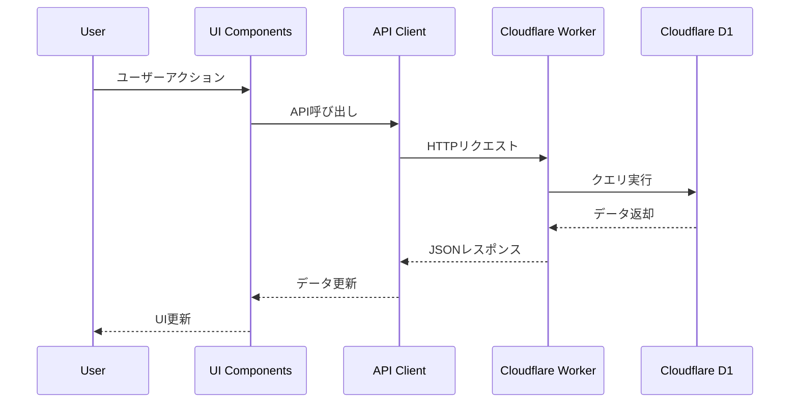

# システムパターン

## アーキテクチャ概要

Memoru は、モダンな Web アプリケーションアーキテクチャを採用しています。フロントエンドは React/TypeScript で構築され、バックエンドは Cloudflare Workers を使用し、データストアには Cloudflare D1 を利用しています。

## 設計パターン

### フロントエンド

1. **コンポーネントベースアーキテクチャ**

   - 再利用可能な UI コンポーネントを作成
   - 各コンポーネントは単一責任の原則に従う

2. **Flux/Redux パターン**

   - 単方向データフロー
   - 予測可能な状態管理
   - アクションによる状態変更

3. **カスタムフック**
   - ロジックの再利用
   - 関心の分離
   - テスト容易性の向上

### バックエンド

1. **RESTful API**

   - リソースベースのエンドポイント設計
   - HTTP メソッドの適切な使用
   - ステートレスな通信

2. **リポジトリパターン**

   - データアクセスロジックの抽象化
   - データソースの詳細をビジネスロジックから隠蔽

3. **ミドルウェアパターン**
   - リクエスト/レスポンスの前処理と後処理
   - クロスカッティングコンサーン（認証、ロギングなど）の分離

## コンポーネント構造

## データフロー

## エラーハンドリング

1. **フロントエンド**

   - グローバルエラーバウンダリ
   - API 呼び出しでの try-catch
   - ユーザーフレンドリーなエラーメッセージ

2. **バックエンド**
   - 構造化されたエラーレスポンス
   - 適切な HTTP ステータスコード
   - エラーログ記録

## パフォーマンス最適化

1. **フロントエンド**

   - コンポーネントのメモ化
   - 遅延ローディング
   - キャッシュ戦略

2. **バックエンド**
   - エッジでの実行（Cloudflare Workers）
   - データベースインデックス
   - レスポンス圧縮

## セキュリティ対策

1. **入力検証**

   - フロントエンドでのフォームバリデーション
   - バックエンドでの厳格な型チェック

2. **データ保護**

   - HTTPS 通信
   - センシティブデータの適切な処理

3. **リクエスト制限**
   - レート制限
   - リソースクォータ
