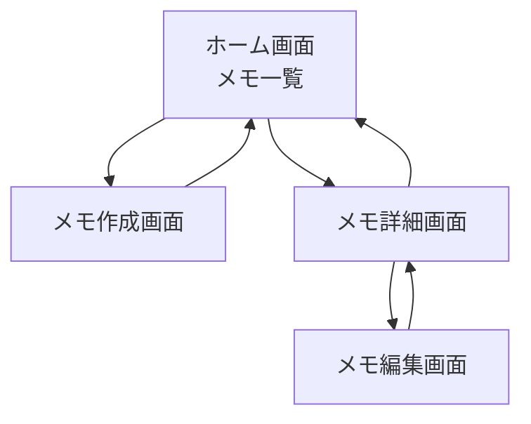

# ページ設計

## 全体構成

Memoru アプリケーションは、以下の 4 つの主要ページで構成されます：

1. メモ一覧ページ（ホーム）
2. メモ詳細ページ
3. メモ作成ページ
4. メモ編集ページ



## 共通コンポーネント

### ヘッダー

- アプリケーション名（Memoru）を表示
- 左側にロゴを配置
- レスポンシブデザイン対応

### フッター

- コピーライト情報
- 作成年（2025）

### ローディングインジケーター

- データ取得中に表示
- スピナーアニメーション

### エラーメッセージ

- エラー発生時に表示
- エラー内容と対処方法を表示

## 1. メモ一覧ページ（ホーム）

### URL

- パス: `/`

### 目的

- 作成したすべてのメモを一覧表示する
- 新規メモ作成への導線を提供する

### コンポーネント構成

- ヘッダー
- メモ一覧
- 新規メモ作成ボタン
- フッター

### 詳細仕様

#### ヘッダー

- タイトル: "Memoru"

#### メモ一覧

- カード形式でメモを表示
- 各カードには以下の情報を表示:
  - メモのタイトル（最大 2 行まで表示、それ以上は省略）
  - 作成日時（YYYY/MM/DD HH:MM 形式）
- 新しいメモが上に表示される（作成日時の降順）
- カードをクリックするとメモ詳細ページに遷移
- メモがない場合は「メモがありません」というメッセージを表示
- ページネーション（1 ページあたり 10 件表示）

#### 新規メモ作成ボタン

- 右下に固定表示
- 円形のフローティングアクションボタン
- アイコン: プラス（+）
- クリックするとメモ作成ページに遷移

### ワイヤーフレーム

```
+----------------------------------+
|  Memoru                          |
+----------------------------------+
|                                  |
|  +----------------------------+  |
|  | タイトル1                  |  |
|  | 2025/04/01 10:00          |  |
|  +----------------------------+  |
|                                  |
|  +----------------------------+  |
|  | タイトル2                  |  |
|  | 2025/04/01 09:30          |  |
|  +----------------------------+  |
|                                  |
|  +----------------------------+  |
|  | タイトル3                  |  |
|  | 2025/04/01 09:00          |  |
|  +----------------------------+  |
|                                  |
|                      [+]        |
|                                  |
+----------------------------------+
| © 2025 Memoru                    |
+----------------------------------+
```

## 2. メモ詳細ページ

### URL

- パス: `/memo/:id`
- パラメータ: `id` - メモの ID

### 目的

- 選択したメモの詳細情報を表示する
- メモの編集・削除への導線を提供する

### コンポーネント構成

- ヘッダー
- 戻るボタン
- メモ詳細
- アクションボタン（編集・削除）
- フッター

### 詳細仕様

#### ヘッダー

- タイトル: メモのタイトル（省略なし）

#### 戻るボタン

- 左上に配置
- アイコン: 戻る矢印
- クリックするとメモ一覧ページに戻る

#### メモ詳細

- メモのタイトル（大きめのフォント）
- メモの内容（本文）
- 作成日時（YYYY/MM/DD HH:MM 形式）
- 更新日時（YYYY/MM/DD HH:MM 形式）

#### アクションボタン

- 編集ボタン
  - 右下に配置
  - アイコン: 鉛筆
  - クリックするとメモ編集ページに遷移
- 削除ボタン
  - 右下、編集ボタンの隣に配置
  - アイコン: ゴミ箱
  - クリックすると削除確認ダイアログを表示

#### 削除確認ダイアログ

- メッセージ: "このメモを削除してもよろしいですか？"
- ボタン: "キャンセル"と"削除"
- "削除"をクリックするとメモを削除し、メモ一覧ページに戻る

### ワイヤーフレーム

```
+----------------------------------+
| ← メモのタイトル                 |
+----------------------------------+
|                                  |
| タイトル                         |
|                                  |
| メモの内容が表示されます。       |
| 複数行にわたる場合もあります。   |
| ...                              |
|                                  |
| 作成日時: 2025/04/01 10:00       |
| 更新日時: 2025/04/01 10:30       |
|                                  |
|                   [🗑️] [✏️]      |
|                                  |
+----------------------------------+
| © 2025 Memoru                    |
+----------------------------------+
```

## 3. メモ作成ページ

### URL

- パス: `/memo/new`

### 目的

- 新しいメモを作成する

### コンポーネント構成

- ヘッダー
- 戻るボタン
- メモ作成フォーム
- アクションボタン（保存・キャンセル）
- フッター

### 詳細仕様

#### ヘッダー

- タイトル: "新規メモ作成"

#### 戻るボタン

- 左上に配置
- アイコン: 戻る矢印
- クリックするとメモ一覧ページに戻る

#### メモ作成フォーム

- タイトル入力欄
  - プレースホルダー: "タイトルを入力"
  - 必須入力
  - 最大 100 文字
  - バリデーション: 空白不可
- 内容入力欄
  - プレースホルダー: "メモの内容を入力"
  - 必須入力
  - 最大 10000 文字
  - 複数行入力可能
  - バリデーション: 空白不可

#### アクションボタン

- 保存ボタン
  - 右下に配置
  - テキスト: "保存"
  - クリックするとメモを保存し、メモ一覧ページに戻る
  - バリデーションエラーがある場合はエラーメッセージを表示
- キャンセルボタン
  - 右下、保存ボタンの隣に配置
  - テキスト: "キャンセル"
  - クリックするとメモ一覧ページに戻る

### ワイヤーフレーム

```
+----------------------------------+
| ← 新規メモ作成                   |
+----------------------------------+
|                                  |
| タイトル                         |
| +----------------------------+   |
| | タイトルを入力             |   |
| +----------------------------+   |
|                                  |
| 内容                             |
| +----------------------------+   |
| | メモの内容を入力           |   |
| |                            |   |
| |                            |   |
| |                            |   |
| +----------------------------+   |
|                                  |
|             [キャンセル] [保存]  |
|                                  |
+----------------------------------+
| © 2025 Memoru                    |
+----------------------------------+
```

## 4. メモ編集ページ

### URL

- パス: `/memo/:id/edit`
- パラメータ: `id` - 編集するメモの ID

### 目的

- 既存のメモを編集する

### コンポーネント構成

- ヘッダー
- 戻るボタン
- メモ編集フォーム
- アクションボタン（保存・キャンセル）
- フッター

### 詳細仕様

#### ヘッダー

- タイトル: "メモ編集"

#### 戻るボタン

- 左上に配置
- アイコン: 戻る矢印
- クリックするとメモ詳細ページに戻る

#### メモ編集フォーム

- タイトル入力欄
  - 既存のタイトルを表示
  - 必須入力
  - 最大 100 文字
  - バリデーション: 空白不可
- 内容入力欄
  - 既存の内容を表示
  - 必須入力
  - 最大 10000 文字
  - 複数行入力可能
  - バリデーション: 空白不可

#### アクションボタン

- 保存ボタン
  - 右下に配置
  - テキスト: "保存"
  - クリックするとメモを更新し、メモ詳細ページに戻る
  - バリデーションエラーがある場合はエラーメッセージを表示
- キャンセルボタン
  - 右下、保存ボタンの隣に配置
  - テキスト: "キャンセル"
  - クリックするとメモ詳細ページに戻る

### ワイヤーフレーム

```
+----------------------------------+
| ← メモ編集                       |
+----------------------------------+
|                                  |
| タイトル                         |
| +----------------------------+   |
| | 既存のタイトル             |   |
| +----------------------------+   |
|                                  |
| 内容                             |
| +----------------------------+   |
| | 既存のメモ内容             |   |
| |                            |   |
| |                            |   |
| |                            |   |
| +----------------------------+   |
|                                  |
|             [キャンセル] [保存]  |
|                                  |
+----------------------------------+
| © 2025 Memoru                    |
+----------------------------------+
```

## レスポンシブデザイン対応

### モバイル（〜767px）

- 一覧ページ: 1 列表示
- フォーム: 縦長レイアウト
- ボタン: タップしやすいサイズ（最小 44px×44px）

### タブレット（768px〜1023px）

- 一覧ページ: 2 列表示
- 余白の拡大

### デスクトップ（1024px〜）

- 一覧ページ: 3 列以上の表示
- 最大幅の制限（1200px 程度）
- サイドバーの追加（将来的な機能拡張用）
