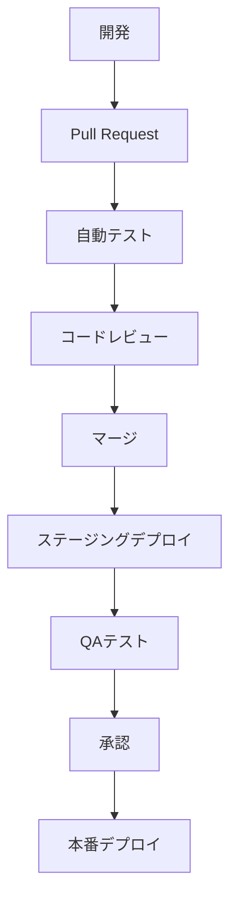

# 技術コンテキスト

## 技術スタック概要

Memoru プロジェクトでは、最新の Web テクノロジーを活用して、高速で信頼性の高いメモアプリケーションを構築します。

### フロントエンド

- **言語**: TypeScript
- **フレームワーク**: React
- **状態管理**: React Context API + useReducer
- **ルーティング**: React Router
- **スタイリング**: CSS Modules + Tailwind CSS
- **ビルドツール**: Vite

### バックエンド

- **プラットフォーム**: Cloudflare Workers
- **言語**: TypeScript
- **データベース**: Cloudflare D1 (SQLite 互換)
- **API 形式**: RESTful JSON API

### インフラストラクチャ

- **ホスティング**: Cloudflare Pages
- **CI/CD**: GitHub Actions
- **モニタリング**: Cloudflare Analytics

## 開発環境セットアップ

### 必要条件

- Node.js v18 以上
- npm v9 以上
- Wrangler CLI (Cloudflare Workers 開発ツール)

### ローカル開発環境構築手順

1. リポジトリのクローン

   ```bash
   git clone https://github.com/username/memoru.git
   cd memoru
   ```

2. 依存関係のインストール

   ```bash
   npm install
   ```

3. 環境変数の設定

   ```bash
   cp .env.example .env.local
   # .env.localファイルを編集して必要な環境変数を設定
   ```

4. ローカル開発サーバーの起動

   ```bash
   # フロントエンド開発サーバー
   npm run dev

   # バックエンド開発サーバー
   npm run dev:worker
   ```

## 主要な技術的決定

### TypeScript の採用理由

- 型安全性によるバグの早期発見
- 優れた IDE サポートと自動補完
- コードの可読性と保守性の向上
- チーム開発での一貫性の確保

### React の採用理由

- コンポーネントベースのアーキテクチャ
- 仮想 DOM による効率的なレンダリング
- 豊富なエコシステムとコミュニティサポート
- 宣言的 UI プログラミングモデル

### Cloudflare Workers の採用理由

- エッジでの実行による低レイテンシー
- グローバルな分散デプロイ
- スケーラビリティと高可用性
- サーバーレスアーキテクチャによる運用コスト削減

### Cloudflare D1 の採用理由

- SQLite との互換性
- Workers との統合
- グローバルレプリケーション
- 低コストでの運用

## 技術的制約

### Cloudflare Workers の制約

- 実行時間の制限（CPU 時間最大 50ms）
- メモリ制限（128MB）
- ステートレスな実行環境
- 一部の Node.js API が利用不可

### Cloudflare D1 の制約

- プレビュー段階の技術
- 複雑なクエリのパフォーマンス制限
- トランザクション機能の制限
- 同時接続数の制限

## 依存関係

### 主要な依存パッケージ

- **react**: UI コンポーネントライブラリ
- **react-dom**: DOM レンダリング
- **react-router-dom**: クライアントサイドルーティング
- **@cloudflare/workers-types**: Workers の型定義
- **tailwindcss**: ユーティリティファースト CSS フレームワーク
- **zod**: スキーマ検証ライブラリ
- **date-fns**: 日付操作ライブラリ

### 開発依存パッケージ

- **typescript**: 型チェックとコンパイル
- **vite**: 高速ビルドツール
- **vitest**: テストフレームワーク
- **eslint**: コード品質チェック
- **prettier**: コードフォーマッティング
- **wrangler**: Cloudflare Workers CLI

## テスト戦略

### ユニットテスト

- Vitest を使用したコンポーネントとユーティリティのテスト
- React Testing Library によるコンポーネントテスト

### 統合テスト

- MSW を使用した API モック
- E2E テスト用のテスト環境

### パフォーマンステスト

- Lighthouse によるパフォーマンス測定
- Core Web Vitals のモニタリング

## デプロイメントフロー

1. GitHub 上での PR の作成
2. GitHub Actions による自動テスト実行
3. PR のマージ後、自動的にステージング環境にデプロイ
4. 手動承認後、本番環境にデプロイ



## パフォーマンス最適化

### フロントエンド

- コンポーネントの遅延ロード
- 画像の最適化
- キャッシュ戦略の実装
- バンドルサイズの最適化

### バックエンド

- エッジキャッシング
- データベースインデックスの最適化
- 効率的なクエリ設計
- レスポンス圧縮
